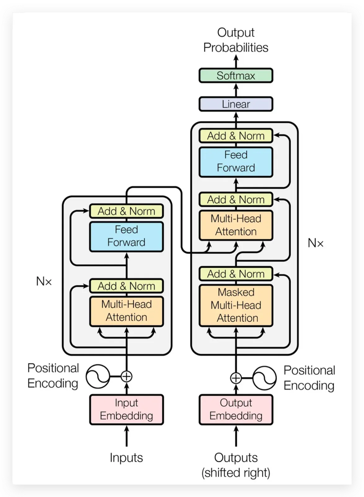
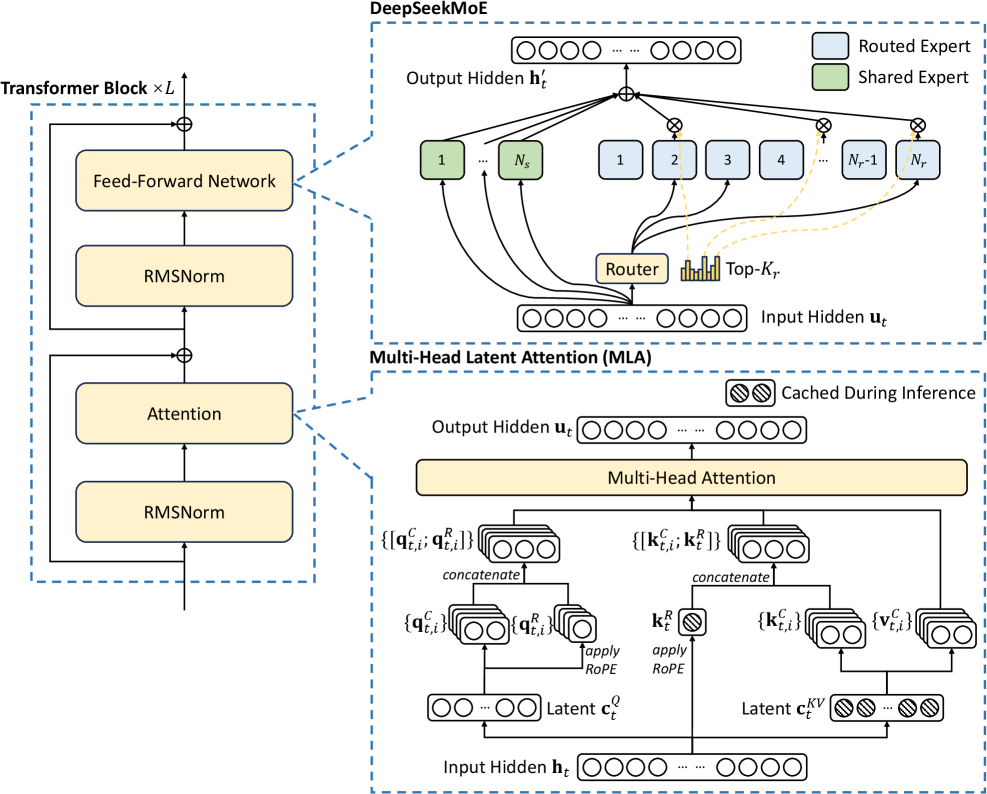
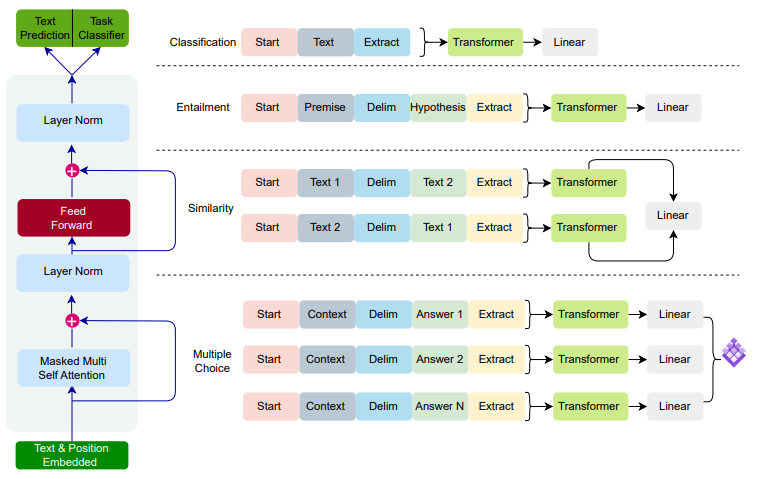
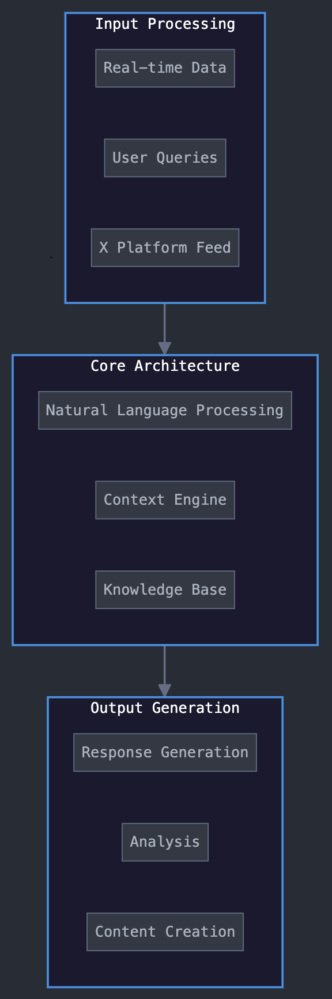
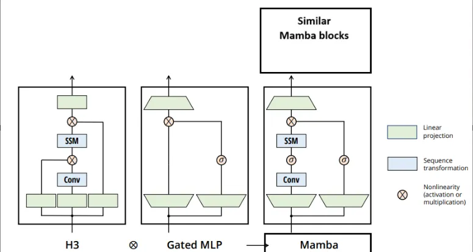

# Beyond the Transformer: How Modern LLMs Like DeepSeek, GPT, Grok, and Mamba Evolve the Architecture

## Introduction

Over the past decade, the Transformer architecture has become the foundation of modern artificial intelligence. Introduced in the 2017 paper *Attention Is All You Need*, transformers replaced traditional sequence models such as recurrent neural networks with an architecture built entirely on attention mechanisms. This innovation enabled models to process entire sequences in parallel while capturing long-range relationships between tokens.

Since then, transformers have powered many of the most influential AI systems, including large language models capable of generating text, writing code, answering questions, and performing complex reasoning tasks.

However, the original transformer architecture is only the starting point.

As models scaled to billions or even trillions of parameters, researchers encountered several challenges, including extremely high training costs, quadratic attention complexity, and inefficient parameter usage. These limitations motivated the development of new architectures and system-level optimizations designed to make large language models more efficient and scalable.

As a result, modern AI systems have evolved beyond the basic transformer design in multiple directions.

Some models, such as GPT, scale dense transformer architectures to massive sizes. Others, like DeepSeek, introduce Mixture-of-Experts routing to activate only a subset of parameters during computation. Systems such as Grok focus on optimizing infrastructure and inference pipelines to support real-time reasoning at scale. Meanwhile, newer architectures like Mamba explore entirely different approaches to sequence modeling that move beyond attention mechanisms.

These developments highlight an important insight:

> Understanding the basic transformer architecture is only the first step. Modern large language models build on top of transformers — and sometimes move beyond them — to achieve better scalability, efficiency, and performance.

In this article, we explore how modern language models evolve from the original transformer design. We begin with a brief recap of the transformer architecture and its limitations, and then examine how different systems such as GPT, DeepSeek, Grok, and Mamba address these challenges through distinct architectural innovations.

---

## The Transformer: The Foundation of Modern LLMs

Most modern large language models are built on top of the Transformer architecture, introduced in the paper *Attention Is All You Need* in 2017. This architecture replaced earlier sequence models such as RNNs and LSTMs, which processed tokens sequentially and struggled to capture long-range dependencies.

Transformers changed this paradigm by introducing self-attention, allowing models to process entire sequences in parallel while learning relationships between tokens. Because of this capability, transformers became the foundation of many modern AI systems, including large language models.

### Self-Attention Mechanism

The core innovation of the transformer is the self-attention mechanism, which allows each token in a sequence to interact with every other token.

For example, in the sentence:
> *The animal that chased the cat was hungry*

The model must understand that “was hungry” refers to “animal”, not “cat”. Self-attention enables the model to compute such relationships by assigning attention weights to tokens.

The attention operation is defined as:

$$\text{Attention}(Q, K, V) = \text{softmax}\left(\frac{QK^T}{\sqrt{d_k}}\right)V$$

Where **Q**, **K**, and **V** represent query, key, and value vectors used to determine how tokens attend to each other.

### Encoder–Decoder Architecture

The original transformer architecture consists of two components: an encoder and a decoder. The encoder processes the input sequence and generates contextual representations, while the decoder uses this information to produce the output sequence.

Both components are built from stacked layers that include:
- **Multi-Head Attention**
- **Feed Forward Networks**
- **Residual Connections**
- **Layer Normalization**

  
   
  <b>Fig 1: The original Transformer architecture introduced in Attention Is All You Need, which forms the foundation of modern large language models.</b>

---

## Dense Transformer Architecture

The original transformer is considered a dense architecture, meaning that all parameters of the network are activated for every token.

While this enables powerful representations, it also increases computational cost when models scale to billions of parameters. Despite this limitation, the transformer architecture remains the foundation of modern large language models. However, as models continued to scale, researchers began exploring new approaches to improve efficiency and scalability.

These developments led to architectures such as **GPT**, **DeepSeek**, **Grok**, and **Mamba**, each introducing different innovations to address the limitations of dense transformers.

## Modern LLM Architectures

Large Language Models (LLMs) have evolved significantly from the original Transformer architecture. While the transformer provides the foundational mechanism for sequence modeling through attention, modern models extend or modify this architecture to improve scalability, efficiency, and real-world deployment.

Different research groups and organizations have explored various directions to enhance transformer-based systems. Some models focus on scaling dense architectures, others introduce sparse computation mechanisms, and some explore alternative sequence modeling approaches beyond attention.

In this section, we examine several modern LLM architectures that demonstrate how the original transformer design has evolved in practice. Each of these models introduces unique architectural ideas that address limitations of the baseline transformer.

## DeepSeek

### Overview

DeepSeek is a modern large language model designed to achieve high performance while maintaining computational efficiency. Unlike traditional dense transformer models, DeepSeek incorporates Mixture-of-Experts (MoE) techniques to scale the model to extremely large parameter counts without activating the entire network during computation.

This design allows DeepSeek models to handle complex reasoning and large-scale language tasks while reducing the computational cost associated with dense architectures.

### Architecture

DeepSeek is built on a transformer-based architecture but integrates a Mixture-of-Experts layer within its feed-forward network components.

In a standard transformer, every token passes through the same feed-forward network. However, in DeepSeek’s architecture, a router mechanism dynamically selects a small subset of specialized expert networks for each token.

Conceptually, the architecture can be represented as:

> **Input Tokens**  
> ↓  
> **Transformer Attention Layer**  
> ↓  
> **Router Network**  
> ↓  
> **Selected Expert Networks**  
> ↓  
> **Combined Output**

Instead of activating all expert networks, the router selects only a few experts for each token. This allows the model to maintain a very large parameter count while keeping the active computation relatively small.

### Mixture-of-Experts architecture:

  
   
  <b>Fig 2: Mixture-of-Experts routing allows the model to activate only a subset of specialized networks for each input token.</b>

### Key Innovation

The main innovation of DeepSeek lies in its sparse Mixture-of-Experts architecture.

Instead of using a dense transformer where all parameters are activated for every token, DeepSeek uses a routing mechanism that selects only a small number of expert networks.

This approach provides several advantages:

- **Scalability**: Enables models to scale to hundreds of billions of parameters
- **Efficiency**: Reduces computational cost during training and inference
- **Specialization**: Allows different experts to specialize in different types of linguistic patterns or reasoning tasks

By activating only a subset of experts, DeepSeek achieves a balance between model capacity and computational efficiency.

### Why It Matters

As language models continue to grow larger, dense transformer architectures become increasingly expensive to train and deploy. The Mixture-of-Experts approach used in DeepSeek provides a practical solution for scaling model capacity without proportionally increasing computation.

This architecture demonstrates how transformer-based systems can evolve beyond their original dense design to support large-scale, efficient language models.

DeepSeek highlights an important direction in modern AI research: leveraging sparse computation and specialized sub-networks to build more scalable and efficient large language models.

## GPT

### Overview

GPT is one of the most influential large language model architectures built on top of the transformer framework. Developed by OpenAI, GPT demonstrated that scaling transformer models with large datasets and massive computational resources can produce highly capable language models.

Unlike the original transformer architecture that uses both an encoder and a decoder, GPT adopts a decoder-only transformer architecture designed specifically for autoregressive language modeling. This design enables the model to generate text sequentially, predicting the next token based on previously generated tokens.

### Architecture

The GPT architecture is based on a stack of transformer decoder blocks. Each block contains the core transformer components, including masked self-attention and feed-forward layers.

A simplified pipeline of the GPT architecture can be represented as:

> **Input Tokens**  
> ↓  
> **Token Embedding + Positional Encoding**  
> ↓  
> **Stacked Transformer Decoder Layers**  
> ↓  
> **Linear Projection**  
> ↓  
> **Softmax Output**

Each decoder layer includes:

- **Masked Multi-Head Self-Attention**, which ensures the model only attends to previously generated tokens
- **Feed-Forward Neural Networks** for nonlinear transformations
- **Residual Connections and Layer Normalization** to stabilize training

The masking mechanism ensures that during training and inference, the model predicts tokens autoregressively, meaning each token is generated based only on past context.

### Transformer decoder architecture:

  
   
  <b>Fig 3: GPT models use a decoder-only transformer architecture designed for autoregressive text generation.</b>

### Key Innovation

The key innovation behind GPT is scaling dense transformer architectures through large-scale pretraining.

Instead of modifying the transformer structure significantly, GPT focuses on:

- **Training very large models**
- **Using massive text datasets**
- **Leveraging powerful GPU/TPU clusters**

This approach follows the scaling laws of language models, which show that performance improves predictably as model size, dataset size, and computational resources increase.

By training on vast amounts of internet text, GPT models learn rich representations of language, enabling them to perform a wide range of tasks such as text generation, summarization, coding assistance, and conversational AI.

### Why It Matters

GPT demonstrated that transformer models could serve as general-purpose language models capable of performing many tasks without task-specific architectures.

This approach fundamentally changed how AI systems are developed. Instead of building specialized models for individual tasks, researchers can train a single large model and adapt it to multiple applications.

The success of GPT established the dense transformer scaling paradigm, showing that increasing model size and training data can lead to dramatic improvements in language understanding and generation.

## Grok

### Overview

Grok is a large language model developed by xAI. It was designed to compete with leading LLMs by combining large-scale transformer architectures with system-level optimizations for reasoning and real-time data access.

Unlike many traditional language models that rely purely on static training data, Grok is tightly integrated with the social platform X (formerly Twitter), allowing it to access and analyze real-time information streams. This enables Grok to provide more up-to-date responses compared to models trained only on historical datasets.

### Architecture

At its core, Grok is built on a transformer-based architecture similar to other large language models, but it includes several modifications designed to improve reasoning, scalability, and deployment efficiency.

A simplified architecture pipeline can be described as:

> **Input Tokens**  
> ↓  
> **Token Embedding + Positional Encoding**  
> ↓  
> **Stacked Transformer Layers**  
> ↓  
> **Reasoning / Optimization Modules**  
> ↓  
> **Output Generation**

The transformer layers use multi-head self-attention to capture relationships between tokens, similar to GPT-style models. However, Grok introduces additional optimizations in its training pipeline and inference infrastructure to handle long-context reasoning and real-time interaction workloads.

### Transformer-based LLM architecture:

  
   
  <b>Fig 4: Grok builds upon transformer-based language model architectures with additional optimizations for reasoning and real-time interaction.</b>

### Key Innovation

The key innovation of Grok lies not only in its model architecture but also in its system-level design and deployment strategy.

Important innovations include:

- **Real-time data integration** with sources from the X platform
- **Large-scale training** using massive GPU clusters
- **Reinforcement learning techniques** to improve reasoning and instruction following

For example, Grok models have been trained using extremely large computing clusters to improve reasoning ability and handle complex tasks such as mathematics, coding, and multi-step problem solving.

These features allow Grok to function as a reasoning-oriented LLM designed for interactive environments.

### Why It Matters

Grok highlights an important trend in modern AI development: large language models are no longer defined only by their neural architecture.

While transformers remain the core modeling technique, real-world AI systems increasingly rely on:

- **Large-scale infrastructure**
- **Reinforcement learning pipelines**
- **Real-time data integration**
- **Optimized inference systems**

This demonstrates that the power of modern LLMs comes not only from the transformer architecture itself, but also from how the architecture is trained, scaled, and integrated into real-world systems.

## Mamba

### Overview

Mamba is a recent architecture designed as an alternative to transformer-based language models. Developed by researchers from institutions including Carnegie Mellon University and Princeton University, Mamba explores a different approach to sequence modeling using Selective State Space Models (SSMs).

Unlike transformer-based models such as GPT, DeepSeek, and Grok that rely heavily on attention mechanisms, Mamba removes attention entirely and replaces it with a state-space sequence modeling framework. This allows the model to process sequences with significantly lower computational complexity while still capturing long-range dependencies.

### Architecture

The Mamba architecture is built on Selective State Space Models, which maintain a dynamic hidden state that evolves as tokens are processed. Instead of computing attention between every pair of tokens, the model updates a continuous state representation as it reads the sequence.

A simplified representation of the architecture can be described as:

> **Input Tokens**  
> ↓  
> **Token Embedding**  
> ↓  
> **Selective State Space Layer**  
> ↓  
> **Gating / State Update Mechanism**  
> ↓  
> **Output Representation**

The key idea is that the model maintains a running internal state that summarizes the sequence seen so far. Each new token updates this state through learned transformations, allowing the model to capture contextual information without computing a full attention matrix.

### Mamba architecture visualization:

  
   
  <b>Fig 5: The Mamba architecture replaces attention with selective state-space layers that update a continuous hidden state across tokens.</b>

### Key Innovation

The key innovation of Mamba lies in replacing the attention mechanism with Selective State Space Models.

Traditional transformer attention has a computational complexity of:

$$O(n^2)$$

because every token must attend to every other token.

In contrast, the state-space mechanism used in Mamba processes tokens sequentially with linear complexity:

$$O(n)$$

This significantly improves efficiency when processing long sequences.

Additionally, Mamba introduces selective gating mechanisms that allow the model to dynamically control how information flows through the state updates, enabling it to capture complex dependencies within sequences.

### Why It Matters

Mamba represents a new direction in large language model research: exploring architectures that move beyond attention-based transformers.

While transformers remain dominant, their quadratic attention complexity becomes increasingly expensive for extremely long contexts. By using state-space models with linear complexity, Mamba demonstrates that it is possible to build language models that scale more efficiently for long sequences.

This architecture highlights an important idea in modern AI research: while transformers have become the standard foundation for LLMs, alternative sequence modeling approaches may play an important role in the future evolution of language models.

## Architecture Comparison

After examining the transformer foundation and the architectures of DeepSeek, GPT, Grok, and Mamba, we can now compare how these models evolve the original design in different ways.

The key idea to observe is that each model addresses a different limitation of the baseline transformer architecture-whether it is scalability, computational efficiency, deployment infrastructure, or sequence modeling itself.

### Comparative Analysis of Architectures

| Model | Core Architecture | Computation Type | Key Innovation | Computational Complexity | Strengths | Limitations |
| :--- | :--- | :--- | :--- | :--- | :--- | :--- |
| **Transformer (Baseline)** | Encoder–Decoder Transformer | Dense | Self-attention mechanism for contextual modeling | $O(n^2)$ attention | Parallel sequence processing, strong contextual learning | High memory and compute cost for long sequences |
| **GPT** | Decoder-only Transformer | Dense | Autoregressive language modeling with large-scale pretraining | $O(n^2)$ attention | Excellent text generation, general-purpose LLM capability | Expensive training and inference at large scale |
| **DeepSeek** | Transformer + Mixture-of-Experts | Sparse | Expert routing activates only a subset of parameters | Reduced active compute vs dense models | Efficient scaling to extremely large parameter counts | More complex training and routing mechanisms |
| **Grok** | Optimized Transformer-based LLM | Dense (system optimized) | Real-time data integration and infrastructure optimization | $O(n^2)$ attention | Strong reasoning capability with real-time interaction | Requires large-scale compute infrastructure |
| **Mamba** | State Space Model (SSM) | Sequential state modeling | Selective state-space mechanism replacing attention | $O(n)$ sequence complexity | Efficient long-context processing and lower memory usage | Still relatively new with limited large-scale deployment |

## Conclusion

The transformer architecture marked a major breakthrough in AI by introducing self-attention and enabling models to understand complex relationships within sequences. It became the foundation for modern large language models.

However, the basic transformer design is only the starting point. As models scale, researchers have introduced new ideas to improve efficiency, scalability, and real-world performance.

Models like DeepSeek use Mixture-of-Experts for efficient scaling, GPT demonstrates the power of scaling dense transformers, Grok focuses on infrastructure and real-time reasoning, while Mamba explores sequence modeling beyond attention.

These developments show that simply understanding the basic transformer architecture is not enough. The real power of modern LLMs comes from how this foundation is extended and implemented in advanced architectures.

For anyone exploring large language models, learning how these systems build upon the transformer architecture is key to understanding the future of AI.

---
*Designed and documented for Modern AI Research.*
