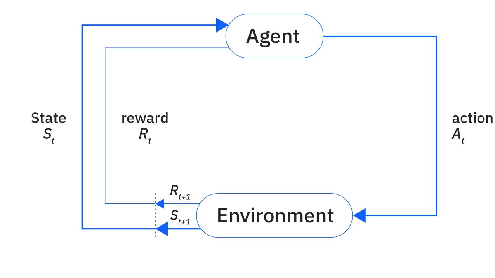

# From Pixels to Torques: Fusing SAM 2 and Reinforcement Learning for Robotic Control

In our previous post, we engineered a complete "Visual Cortex" for a robotic system. By fusing a **DepthAnythingV2** backbone (powered by DINOv2 for semantic understanding) with Foundation Stereo and SAM 2, our robot gained the ability to explicitly understand the 3D geometry of its environment and draw pixel-perfect masks around target objects.

But seeing the wrench is only half the battle. The robot must now figure out how to physically move its joints to grasp it.

Historically, engineers solved this using hardcoded kinematics (the "Puppet" approach). A programmer calculates the exact math required to move the arm from Point A to Point B. But the real world is chaotic. If the table gets bumped, or the wrench slips by two inches, the hardcoded puppet blindly grasps at empty air.

To build truly autonomous machines, we cannot hardcode their movements. We must allow them to learn how to move dynamically. To achieve this, we transition from the world of Computer Vision into the fascinating world of Reinforcement Learning.

## Demystifying Reinforcement Learning (The Fundamentals)

Before we dive into how our custom SAM 2 pipeline connects to the robot's motors, we need to establish exactly how artificial intelligence learns to interact with the physical world.

As defined by [IBM's AI research](https://www.ibm.com/think/topics/reinforcement-learning), Reinforcement Learning (RL) is a machine learning framework in which an autonomous agent learns to make sequential decisions by interacting with an environment.

Unlike Supervised Learning (which requires human-labeled data to learn right from wrong) or Unsupervised Learning (which looks for hidden patterns in unlabeled data), an RL agent learns purely through trial and error. It has no instruction manual. It simply takes an action, observes the result, and receives a numerical reward if it did something good, or a penalty if it failed.

  
   
  <b>Figure 1: Reinforcement Learning</b>

To mathematically structure this learning process—often formulated as a Markov Decision Process (MDP)—RL relies on a few core components:

- **The Agent & The Environment**: The Agent is our AI (the brain driving the robotic arm). The Environment is the physical world (the table, gravity, friction, and the wrench).
- **The State Space ($S_t$)**: This represents everything the robot currently knows about the world. It includes all available information relevant to decision-making, such as our SAM 2 visual masks and the current angles of the robot's mechanical joints.
- **The Action Space ($A_t$)**: This contains all the decisions the agent is permitted to make. For a robotic arm, this usually means applying specific electrical torques to its motors.
- **The Reward Signal ($R_t$)**: The ultimate measure of success. Each action receives a scalar value. If the robot moves its gripper closer to the wrench, it gets $+10$ points. If it smashes its arm into the table, it gets $-50$ points.
- **The Policy ($\pi$)**: This is the ultimate goal of RL. The policy is the "thought process" or strategy the AI develops over time. It is a mathematical function that maps a perceived State to the best possible Action to maximize long-term cumulative rewards.

### The Human Element: RLHF

While the RL framework sounds perfectly logical, there is a catch: How do you write a mathematical reward function for something subjective? In a board game like Chess, the reward is objective (Win = 1, Lose = 0). But in robotics, defining a "good, safe, and smooth grasp" is incredibly difficult. If we simply reward the robot for "touching the wrench as fast as possible," the RL agent will likely learn to violently slam its metal gripper into the tool at maximum velocity.

To solve this, modern AI relies on a concept called [Reinforcement Learning from Human Feedback (RLHF)](https://www.ibm.com/think/topics/rlhf). 

RLHF is famous for training Large Language Models (like ChatGPT). Because it is impossible to write a mathematical equation for what makes a joke "funny" or a response "helpful," engineers use human raters to score the AI's outputs. These human preferences are distilled into a "Reward Model," which then automatically trains the AI agent using RL.

**While classic RLHF uses human preference rankings to train a separate reward model, we adapt the same human-in-the-loop philosophy for robotics by using motion-capture trajectories as our "grading rubric" — a technique we later implement via the DeepMimic framework.**

With the foundational theory established, let's connect the wires. Here is how we translate our SAM 2 vision pipeline into an RL state space.

## Phase 1: The State Space (Translating SAM 2 Vision to RL)

An RL algorithm cannot simply "look" at a video feed. If you feed raw, high-resolution video into a control network, the mathematical dimensionality is so high that the AI will take months to learn anything. We must compress reality into a highly efficient State Space ($S_t$).

This is where the magic of our previously built vision pipeline shines. Because we already processed the raw video through SAM 2 and Foundation Stereo, we don't need to feed raw pixels to the RL brain. Instead, we feed it a clean, structured vector of data:

- **The Visual State (The Target)**: Instead of millions of pixels, our pipeline outputs the exact 3D coordinates of the target object's physical boundaries (e.g., the wrench), derived directly from the SAM 2 mask and the Stereo Depth Map.
- **The Proprioceptive State (The Body)**: The robot also needs to know its own physical posture. We pull data directly from the robot's hardware encoders: the current angles of its 6 mechanical joints, their rotational velocities, and the exact 3D position of its gripper.

By combining these two data streams into a single 1D tensor, we give the RL brain a perfect, lightweight mathematical summary of the world at every millisecond.

## Phase 2: The Environment (NVIDIA Isaac Sim & Domain Randomization)

If you try to train an RL policy on a physical robotic arm, it will fail. In the first 10,000 attempts, the RL agent will just flail randomly, outputting maximum torque to random motors and **risking destruction of your expensive hardware**.

Training requires a virtual sandbox. For this, we built our environment in NVIDIA Isaac Sim.

Isaac Sim is an advanced robotics simulation platform built on the Omniverse framework. By running our simulation on an NVIDIA GPU, we can spawn **thousands of identical robotic arms (up to 4,000 in parallel environments)** on a single high-end GPU, training them simultaneously. What would take 10 years of trial-and-error in the real world takes less than a weekend in Isaac Sim.

- **The Sim-to-Real Problem**: However, simulations are perfect, and reality is messy. If a robot trains in a perfect simulation, it will fail in the real world when the lighting changes or the motors experience unexpected friction.
- **The Fix**: We use Domain Randomization. During training, we explicitly randomize the physics of the simulation. We slightly alter the gravity, the friction of the table, the weight of the wrench, and the virtual lighting in every single episode. The robot learns to succeed despite unpredictable physics. When we finally deploy the brain to the physical robot, it simply views the messy real world as "just another slightly weird simulation."

## Phase 3: The Motor Cortex (PPO & Actor-Critic)

With the environment built, we must choose the algorithmic architecture of the "Brain." Because our robot requires smooth, continuous motor controls (not discrete "up/down/left/right" commands like a video game), we use the industry-standard Proximal Policy Optimization (PPO) algorithm.

PPO uses an Actor-Critic architecture, which splits the AI's brain into two separate neural networks:

- **The Actor**: This network looks at the State Space and outputs the actual physical actions (e.g., "Apply 2.5 Nm of torque to Joint 3").
- **The Critic**: This network watches the Actor and judges its performance, calculating the expected future rewards of the current state.

**Engineering Note**: The brilliance of PPO is the word Proximal. In older RL algorithms, if the robot found a good move, it would update its math so aggressively that it would accidentally overwrite and forget how to do other basic tasks (catastrophic forgetting). PPO mathematically "clips" the updates, ensuring the robot only makes small, safe, incremental changes to its policy at a time.

## Phase 4: The "DeepMimic" Secret (Imitation + Task)

Here is the final engineering hurdle: If we just put a robotic arm in Isaac Sim and say, "Grab the wrench for +100 points," the RL agent will invent bizarre, chaotic ways to move. It might vibrate its joints violently to inch toward the target. This is known as "Alien Motion," and it destroys physical hardware.

To solve this, we integrated the groundbreaking techniques from the famous 2018 research paper [DeepMimic: Example-Guided Deep Reinforcement Learning (Peng et al.)](https://arxiv.org/abs/1804.02717).

DeepMimic proved that you don't have to choose between hardcoded "Puppet" animations and chaotic "Alien" RL. You can fuse them together. We take human-operated motion-capture data (e.g., a human smoothly teleoperating the robotic arm to grab a wrench) and use it as a strict "grading rubric" for the AI.

We achieve this by engineering a Composite Reward Function:

$$
R_{total} = \omega_I R_{imitation} + \omega_T R_{task}
$$

- **The Task Reward ($R_{task}$)**: Did the robot successfully navigate to the SAM 2 coordinates and grasp the wrench?
- **The Imitation Reward ($R_{imitation}$)**: Did the robot's joint angles and velocities smoothly match the human reference data while doing it?

The AI quickly learns that it cannot just achieve the goal; it must achieve the goal elegantly. (The weights $\omega_I$ and $\omega_T$ are tuned during training so the robot first learns smooth, human-like motion before optimizing purely for task success.)

### The Two DeepMimic Training Hacks

To make this actually converge and learn, we implemented two crucial simulation hacks detailed in the DeepMimic paper:

- **Reference State Initialization (RSI)**: If you always spawn the robot in its default resting position, it will constantly fail the final grasp and never get to practice it. RSI forces the simulation to randomly start the episode at any point in the motion-capture data. Sometimes the robot spawns already inches away from the wrench, allowing it to master the delicate grasping physics before it masters the broad sweeping motions.
- **Early Termination (ET)**: The instant our pipeline detects a collision (e.g., the robot's gripper clips the table based on our Stereo Depth map), the episode is instantly killed and reset. We do not let the GPU waste computing power simulating a robot grinding its gears against a table.

## Conclusion: The Fully Autonomous Machine

We have officially traversed the entire pipeline of modern Embodied AI.

We started with a chaotic array of pixels. We passed them through a **DepthAnythingV2 backbone** (powered by DINOv2 for semantic understanding) and a Foundation Stereo head to extract the geometry. We bridged that data using a custom multi-scale adapter, allowing SAM 2 to draw a pixel-perfect, 3D-aware mask around our target object.

Finally, we translated that visual geometry into a mathematical state space, feeding it into a PPO Actor-Critic brain inside NVIDIA Isaac Sim. Guided by human reference data via DeepMimic mechanics, the robot learned to dynamically apply physical torques to its motors to secure the target.

This is the end of the hardcoded puppet. By fusing spatial-temporal computer vision with example-guided reinforcement learning, we are no longer programming robots. We are teaching them how to see, think, and interact with the physical world.
