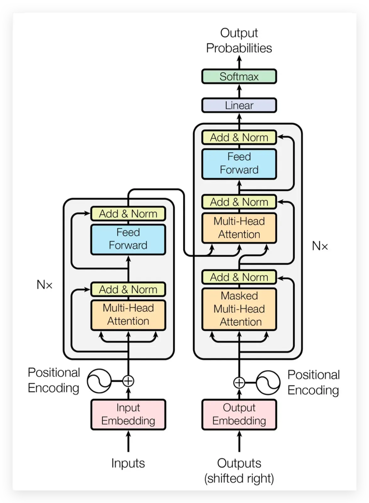
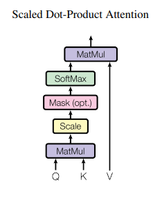
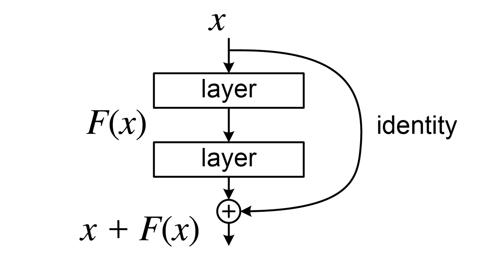
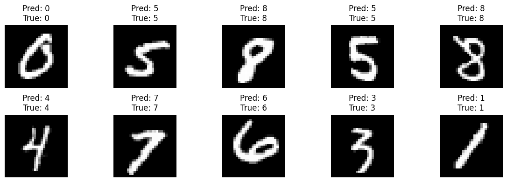

# The Transformer Architecture: Research & Implementation Notes

Welcome to the research documentation on the **Transformer Architecture**, a groundbreaking model first introduced in the seminal research paper by Vaswani et al. ([Attention Is All You Need, 2017](https://arxiv.org/abs/1706.03762)). This repository combines insights from the original paper with practical handwritten notes and PyTorch implementations, covering both classic NLP Transformers and modern Vision Transformers (ViT).

---

## 📸 Architecture Overview

*Figure 1: The Encoder-Decoder structure of the original Transformer from "Attention Is All You Need".*

### Why the Transformer Shifted NLP History
Before the advent of the Transformer, Sequence-to-Sequence (Seq2Seq) tasks relied heavily on Recurrent Neural Networks (RNNs) and Long Short-Term Memory (LSTM) models. These models processed data sequentially, leading to major bottlenecks:
1. **Vanishing Gradients / Memory Loss:** Information from the start of a long sequence deteriorated by the time it reached the end.
2. **Computational Inefficiency:** Sequential operations cannot be parallelized efficiently on GPUs.

The Transformer eradicated recurrence entirely. By leveraging exclusively on the **Attention Mechanism**, it processes all sequences *in parallel*, significantly drastically reducing training times and setting new state-of-the-art BLEU scores across translation benchmarks.

---

## 1. Data Preparation: Tokenization & Embeddings
Before data can be processed by a Transformer, it must be converted from raw text (or images) into mathematical representations.

1. **Tokenization:** Input sentences are broken down into discrete tokens (words or subwords).
2. **Input Embeddings:** These tokens are converted into high-dimensional dense vectors (e.g., 768 dimensions). This embedding step captures the semantic meaning of each token.
3. **Positional Encoding:** Unlike older Sequential models (RNNs, LSTMs, GRUs) that process data sequentially (and suffer from memory loss or vanishing gradients), Transformers process data in **parallel**. Positional encodings act like "GPS coordinates" added to the input embeddings so that the model understands the positional order of the words. Formally, this uses sine and cosine functions of different frequencies for even and odd positions:
   $$ PE_{(pos, 2i)} = \sin(pos / 10000^{2i/d_{model}}) $$
   $$ PE_{(pos, 2i+1)} = \cos(pos / 10000^{2i/d_{model}}) $$

---

## 2. Core Engine: Self-Attention & The Q, K, V Matrices
Self-attention is the mechanism that allows the model to weigh the importance of different words in a sentence relative to a specific word. It computes an attention score for each word.

The inputs are separated into three distinct vectors:
* **Query ($Q$):** What am I looking for? (The current focus word)
* **Key ($K$):** What do others have? (The traits of other words in the sentence)
* **Value ($V$):** The actual information contained in the word.

### Scaled Dot-Product Attention
This maps a query and a set of key-value pairs to an output. The formula is:

$$ \text{Attention}(Q, K, V) = \text{softmax}\left(\frac{QK^T}{\sqrt{d_k}}\right)V $$

By taking the dot product of $Q$ and $K$ (and dividing by $\sqrt{d_k}$ to stabilize gradients), we obtain the "attention scores". We apply a Softmax function to normalize these weights to probabilities (0 to 1). Finally, we multiply these weights by $V$ to emphasize the most contextually relevant words.

*Figure 2: Scaled Dot-Product Attention mechanism visualizing the matrix multiplication flow.*

### Multi-Head Attention
Instead of performing a single attention function, the Q,K,V vectors are linearly projected $h$ times in parallel. The results are concatenated and projected again. This allows the model to jointly attend to information from different representation subspaces at different positions. The formula is defined as:

$$ \text{MultiHead}(Q, K, V) = \text{Concat}(\text{head}_1, ..., \text{head}_h)W^O $$
where $$ \text{head}_i = \text{Attention}(QW_i^Q, KW_i^K, VW_i^V) $$

Here, the projections are parameter matrices $W_i^Q \in \mathbb{R}^{d_{model} \times d_k}$, $W_i^K \in \mathbb{R}^{d_{model} \times d_k}$, $W_i^V \in \mathbb{R}^{d_{model} \times d_v}$, and $W^O \in \mathbb{R}^{hd_v \times d_{model}}$.

*Figure 3: Multi-Head layout splitting vectors parallelly to compute distinct contextual sub-spaces before concatenation.*

---

## 3. The Architecture Components

### A. The Encoder (Understanding the Input)
The Encoder is responsible for deeply analyzing the input features by converting the initial token sequence into a continuous representation that holds context. It consists of multiple identical cascaded layers ($N=6$ in the base model), each containing two primary sub-layers:
* **Multi-Head Self-Attention**
* **Position-wise Feed-Forward Networks (FFN):** These process the extracted features from the previous attention stage individually and identically for each position. It consists of two linear transformations with a ReLU activation in between:
  $$ \text{FFN}(x) = \max(0, xW_1 + b_1)W_2 + b_2 $$
* **Add & Norm (Skip/Residual Connections):** Around each of the two sub-layers, there is a residual connection followed by layer normalization. The output of each sub-layer is $LayerNorm(x + Sublayer(x))$. This protects against the vanishing gradient problem in deep networks. Layer Normalization ($Mean=0, Variance=1$) keeps the activations at a manageable scale to maintain math stability throughout the deep network.

*Figure 4: Residual skip connections wrapping around the core Encoder sub-layers to maintain information integrity.*

### B. The Decoder (Generating the Output)
The Decoder is an auto-regressive model that takes the encoder's encoded context and the previously generated outputs to predict the next token. Like the Encoder, it is composed of $N=6$ identical layers, but inserts a third sub-layer:
* **Masked Multi-Head Attention:** It ensures that the sequence generation is purely causal. It masks out all subsequent positions (setting them to $-\infty$ during the Softmax computation) so the model can only look at *past* words, blocking future tokens to prevent the model from "cheating" during training.
* **Cross-Attention (Encoder-Decoder Attention):** This sub-layer performs attention over the output of the encoder stack. It computes attention using the Decoder's generated Query ($Q$) against the Encoder's Key ($K$) and Value ($V$) representations. This is how the text generation ties back to the input context!
* **Linear & Softmax:** Converts the final decoder output vector into a predicted word probability distribution over the entire vocabulary. The token with the highest probability is generated/predicted sequentially.

---

## 4. Hyperparameters & Computational Complexity
*From the "Attention Is All You Need" Base Model implementation.*

### Core Hyperparameters
To facilitate these operations, the authors defined specific architectural dimensions:
* **$d_{model} = 512$:** The dimension of inputs and outputs across all sub-layers (Embedding size). This keeps residual connections structurally perfectly aligned.
* **$N = 6$:** Number of stacked identical layers for both Encoder and Decoder.
* **$h = 8$:** Number of parallel attention "Heads".
* **$d_k = d_v = d_{model}/h = 64$:** Dimension of the divided $Q, K, V$ matrices.
* **$d_{ff} = 2048$:** The inner-layer dimensionality of the Feed-Forward Network.

### Why Attention scales better than Recurrence
Self-attention connects all positions with a constant number of sequentially executed operations, $O(1)$, whereas recurrent layers require $O(n)$ operations. 

For sequences where sequence length $n$ is smaller than the representation dimensionality $d$ (which is the case for most state-of-the-art models), self-attention is mathematically faster.
* **Self-Attention Complexity per Layer:** $O(n^2 \cdot d)$
* **Recurrent Complexity per Layer:** $O(n \cdot d^2)$

---

## 4. Vision Transformers (ViT) & Data
*"Treat a photograph exactly like a sentence of words."*

A significant comparison to classic Convolutional Neural Networks (CNNs) is the introduction of **Vision Transformers (ViT)**.
1. **Tokenization (Patches):** Instead of processing raw pixels, an image (e.g., $224 \times 224$ pixels) is chopped into a perfect grid of squares called *patches* (e.g., $P \times P = 16 \times 16$). This yields $N = \frac{H \times W}{P^2} = 196$ patches. Each patch is treated as a "word" in a sentence.
2. **Flattening / Patch Embedding (`nn.Conv2d` / `nn.Linear`):** We flatten these 3D blocks of pixels ($16 \times 16 \times 3$ RGB channels) into a single 1D list of $768$ numbers. This linear projection transforms raw color to a rich feature vector.
3. **[CLS] Token Prepending:** Before the 196 tokens are sent to the main engine, we add one more vector called the `[CLS]` (Classification) token. The sequence now has **197 tokens**. The `[CLS]` acts like a "sponge"—it absorbs the global context from all other 196 patches while they exchange information. Ultimately, for image classification, the network just looks at the output of the `[CLS]` token.
4. **Positional Encoding:** Patch vectors + Positional vectors. Added precisely like in text to give spatial context, stamping "GPS coordinates" onto every single patch to generate 197 unique positional vectors.

### Tensors & PyTorch Level Implementation
Tensors represent data across varying dimensions (a grid of numbers):
* **1D:** List (e.g., `[1.0, 2.0, 3.0]`)
* **2D:** Rows and columns (Matrices)
* **3D:** Images with color channels (Height, Width, RGB)
* **4D:** Vision Batches (Batch size, Channels, Height, Width) -> `B, C, H, W`
* **5D:** Video sequences -> `B, T, C, H, W`

**PyTorch functions commonly used:**
* `torch.nn.Linear`: Fully connected layer used to create Q, K, V matrices and classify/shrink data.
* `torch.nn.Conv2d`: Often used practically to fast-chop images into patches natively.
* `torch.nn.MultiheadAttention`: The core engine taking Q, K, V to yield context.
* `torch.nn.LayerNorm`: Normalizes data.
* `Autograd`: PyTorch invisibly records operations on tensors so that calling `.backward()` instantly calculates all required calculus/gradients.

---

## 5. Practical Implementation Flow: ViT on MNIST
*Based on PyTorch Vision Transformer architecture building flows.*

To implement a Vision Transformer from scratch (e.g., classifying handwritten digits from the MNIST dataset), the process is practically broken down into exactly 6 phases:

* **Phase 1: Data Loading (MNIST) & Setup**
  Importing standard `torch` utilities. Creating the base network using `nn.Module`. By calling `super().__init__()`, the child class inherits properties from the parent `nn.Module` layer without overwriting them, so we can add new logic on top.

* **Phase 2: Patch Embedding**
  Slicing the image using `nn.Conv2d`. For a typical $224 \times 224$ image with $16 \times 16$ patches, this step yields an output shape of `(Batch, 196, 768)`. 196 tokens are created by converting the image.

* **Phase 3: Positional Encoding & [CLS] Token**
  Using `nn.Parameter` to generate learnable numbers for our Positional Encoding vectors and prepending the `[CLS]` sequence. 

* **Phase 4: Multi-Head Attention**
  Utilizing `nn.Linear` as the generator to create Query ($Q$), Key ($K$), and Value ($V$) representations. This pushes into the Self-Attention mechanism, where all 197 GPS-stamped vectors look at each other to capture contextual relationships.

* **Phase 5: LayerNorm, MLP & Skip Connections (Add)**
  Keeping the math stable. This acts as a mini-NN enriching the context of the vector while residual skip connections maintain the original information flow without degradation.

* **Phase 6: Model Training Loop**
  The standard PyTorch training loop on MNIST dataset data: loading, train-val split, batching, forward pass, `loss.backward()`, and `optimizer.step()`.

*Figure 5: Vision Transformer classification results after compiling and training the 6 phases on the MNIST handwritten digit dataset.*

---
*This repository serves as a master reference for understanding transformer dynamics across NLP and Computer Vision fields.*
