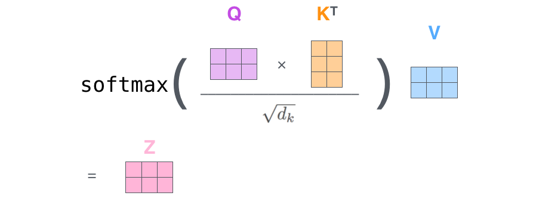
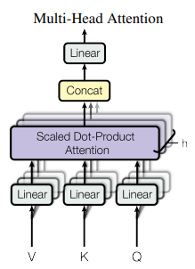

# The Attention Revolution: A Deep-Dive Into the Transformer Architecture
### *Deconstructing the engine of modern AI, from tokens to global graph relationships.*

In 2017, the landscape of Artificial Intelligence shifted on its axis. A group of researchers at Google published "Attention Is All You Need," a paper that proposed discarding the recurrent and convolutional architectures that had dominated the field for decades. In their place, they introduced the Transformer.

Today, this architecture isn't just a model; it is the fundamental building block of the modern world. It is the "engine" inside ChatGPT, the "eyes" of Vision Transformers, and the "logic" behind AlphaFold. To truly understand how modern AI works, we must deconstruct the Transformer from the ground up—not just as a list of components, but as a masterpiece of mathematical engineering.

  
   
  <b>Fig 1: Architecture Pipeline</b>

---

## Beyond the Sequential Bottleneck: Why We Needed a Change

For years, the gold standard for language was the Recurrent Neural Network (RNN) and its more advanced cousin, the LSTM. These models had a fundamental "inductive bias": they assumed that language must be processed in order, from left to right.

*While this sounds logical, it created two massive hurdles:*

1. **The Sequential Constraint**: You could not calculate the state of the 100th word until you had finished the 99th. This meant that the massive parallel processing power of modern GPUs was largely wasted.
2. **Information Decay**: As a sentence grew longer, the "signal" from the beginning of the sentence would often vanish before it reached the end. Even with LSTMs, long-range dependencies were fragile.

> **The breakthrough:** The Transformer realized that global dependencies could be captured in a single step using Self-Attention. By treating a sequence not as a chain, but as a fully connected graph, the Transformer reduced the "path length" between any two words to exactly $O(1)$.

---

## The Foundation: From Tokens to Vectors

Before the math begins, text must be translated into a language the Transformer understands: numbers.

### Tokenization and the Embedding Space
We don't feed "words" into the model; we feed tokens. Using algorithms like Byte-Pair Encoding (BPE), we break text into manageable chunks. These tokens are then mapped into a high-dimensional space called the Embedding Layer.

$$X \in \mathbb{R}^{n \times d_{model}}$$

In a standard model, $d_{model}$ might be 512. Here, a word is no longer a discrete label; it is a point in a 512-dimensional universe where "Paris" and "London" are mathematically adjacent.

### The Problem of Order: Positional Encoding
Because the Transformer processes all tokens simultaneously, it is inherently "order-blind." To the attention mechanism, "The dog bit the man" and "The man bit the dog" look identical.

To restore the sense of time and order, we use **Positional Encoding**. Instead of adding simple integers (1, 2, 3), which could grow too large and destabilize the model, the authors used a clever combination of sine and cosine functions:

$$PE(pos, 2i) = \sin\left(\frac{pos}{10000^{2i/d}}\right)$$
$$PE(pos, 2i+1) = \cos\left(\frac{pos}{10000^{2i/d}}\right)$$

**Where:**
- `pos` = token position
- `i` = dimension index
- `d` = embedding size

By adding these oscillating waves to our embeddings, every token carries a unique "timestamp" that tells the model exactly where it sits in the sequence.

---

## The Core Engine: Scaled Dot-Product Attention

If the Transformer has a "heart," it is **Self-Attention**. This mechanism allows the model to look at an input sequence and, for every word, decide which other words are most important for understanding its context.

To achieve this, the model projects each input embedding into three distinct vectors through learned linear transformations: **Query (Q)**, **Key (K)**, and **Value (V)**.

**Linear projections:**
$$Q = XW_Q, \quad K = XW_K, \quad V = XW_V$$

### Intuition
| Vector | Meaning |
| :--- | :--- |
| **Query** | What information am I searching for? |
| **Key** | What information do I contain? |
| **Value** | The actual information to pass forward. |

### The Intuition of the "Scale"
Why do we divide by $\sqrt{d_k}$? As the dimensionality increases, the dot product $QK^T$ can grow very large in magnitude. Large values push the softmax function into regions where the gradient is extremely small, causing the model to stop learning. Scaling by the square root of the dimension keeps the variance stable.

**Core transformer computation:**
$$\text{Attention}(Q, K, V) = \text{softmax}\left(\frac{QK^T}{\sqrt{d_k}}\right)V$$

### Steps:
1. **Compute similarity**: $QK^T$
2. **Scale**: Divide by $\sqrt{d_k}$
3. **Normalize**: Apply Softmax
4. **Aggregate**: Weighted value sum

  
   
  <b>Fig 2: Self Attention Mechanism</b>

---

## Softmax in Transformer Attention

In the transformer attention formula:
$$\text{Attention}(Q, K, V) = \text{softmax}\left(\frac{QK^T}{\sqrt{d_k}}\right)V$$

The softmax function converts raw attention scores into probabilities. These probabilities determine how much attention one token should give to another token.

### Softmax Formula
The softmax function is defined as:
$$\text{softmax}(x_i) = \frac{e^{x_i}}{\sum_{j} e^{x_j}}$$

**Where:**
- $x_i$ = input score
- $e$ = exponential function

### Role of Softmax in Transformers
In the attention formula:
$$\text{softmax}\left(\frac{QK^T}{\sqrt{d_k}}\right)$$

Softmax converts similarity scores into a probability distribution. These probabilities are then used to weight the Value vectors (V). So the final output becomes a weighted combination of token information.

  
   
  <b>Fig 3: Softmax Normalization</b>

---

## Multi-Head Attention: Expanding the Field of View

A single attention mechanism might focus only on the syntactic relationship between words. However, language is multi-faceted. To capture this complexity, we use **Multi-Head Attention (MHA)**.

By splitting our 512-dimensional space into multiple "heads", the model can attend to different information in parallel:
- **Head 1** might focus on the subject-verb relationship.
- **Head 2** might focus on the emotional tone.
- **Head 3** might track the relationship between pronouns and their antecedents.

  
   
  <b>Fig 4: Multi-Head Attention Mechanism</b>

---

## The Architectural Glue: Residuals and Normalization

If Self-Attention is the brain of the Transformer, Residual Connections and Layer Normalization are the nervous system and the skeletal structure. Without them, a 6-layer (or 175-billion parameter) model would be mathematically impossible to train.

### Residual Connections: The "Highway" for Gradients
In deep neural networks, we face the Vanishing Gradient Problem. As we backpropagate through many layers, the gradient (the signal used to update weights) is multiplied repeatedly. If these values are even slightly less than 1, they shrink exponentially until the early layers of the model "stop learning" because their updates become effectively zero.

The Transformer solves this using **Residual (or Skip) Connections**, originally popularized by ResNet. For any sub-layer $f(x)$ (like Attention or FFN), the output is actually:
$$Output = x + f(x)$$

  
   
  <b>Fig 5: Residual Connections</b>

By adding the original input $x$ to the output of the function, we create a "shortcut" for the gradient. During backpropagation, the gradient can flow through the $+x$ term directly to earlier layers without being distorted by the complex weights of the attention mechanism. This allows us to stack dozens of layers while maintaining a strong training signal.

### Layer Normalization: Keeping the Math Stable
While Residual Connections help the signal flow, **Layer Normalization (LayerNorm)** keeps that signal within a manageable range.

Unlike Batch Normalization (common in CNNs), which calculates statistics across a "batch" of different images, LayerNorm calculates the mean ($\mu$) and variance ($\sigma$) across the embedding dimension of a single token.

1.  **Calculate**: For each token vector, find the average and standard deviation of its elements.
2.  **Normalize**: Subtract the mean and divide by the variance to center the data at 0 with a spread of 1.
3.  **Scale and Shift**: Apply two trainable parameters, $\gamma$ (gamma) and $\beta$ (beta), to allow the model to "re-adjust" the normalization if it needs to.

> **Why LayerNorm?** It makes the model robust to different sequence lengths and ensures that the activations at each layer don't "explode" into massive numbers that would break the Softmax calculation.

---

## The "Thinking" Step: Position-Wise Feed-Forward Networks

A common mistake is thinking that the Attention mechanism does all the work. In reality, Attention is only responsible for **Information Routing**—it moves information between tokens. The actual **Information Processing** (the "thinking") happens in the Position-Wise Feed-Forward Network (FFN).

Every encoder and decoder layer contains an FFN. It consists of two linear transformations with a non-linear activation (usually ReLU or GELU) in between:
$$\text{FFN}(x) = \text{max}(0, xW_1 + b_1)W_2 + b_2$$

### The Expanding-Contracting Pattern
The FFN usually follows an "expansion" strategy. If your model dimension ($d_{model}$) is 512, the first linear layer typically projects that vector up into a much higher-dimensional space (usually 2048).

-   **The Expansion**: Going from 512 to 2048 allows the model to map the token's features into a higher-dimensional space where it can find more complex patterns.
-   **The Contraction**: The second layer projects it back down to 512 so it can be passed into the next Transformer block.

> **Why is it called "Position-Wise"?** Because the exact same FFN (with the same weights $W_1, W_2$) is applied to every token in the sequence independently. There is no communication between tokens in this step; the FFN treats each word as its own separate problem to solve.

---

## The Encoder vs. The Decoder: A Tale of Two Streams

While they look similar, the Encoder and Decoder have fundamentally different philosophies and structural rules.

### The Encoder: The Global Observer
The Encoder is "Bi-directional." For any token (like "Bank"), the Encoder looks at the tokens to the left and to the right simultaneously. Its goal is to create a "**Contextualized Embedding**"—a mathematical representation of a word that changes based on its surroundings.
*Example: In "The bank of the river," the vector for "bank" is infused with the meaning of "river."*

  
   
  <b>Fig 6: Encoder Diagram</b>

### The Decoder: The Autoregressive Generator
The Decoder is "Uni-directional" and Autoregressive. It generates one token at a time, and every token it generates becomes part of the input for the next step. To achieve this, it uses two unique mechanisms:

#### 1. Masked Self-Attention
In the Encoder, word 1 can see word 10. In the Decoder, this is forbidden during training. If the model is trying to predict the 3rd word in a translation, it shouldn't be allowed to "see" the 4th word in the ground truth. We apply a **Look-Ahead Mask** (a matrix of $-\infty$) to the attention scores, effectively "blinding" the model to the future.

  
   
  <b>Fig 7: Decoder Diagram</b>

#### 2. Encoder-Decoder (Cross) Attention
This is the bridge between the two streams. In this layer:
- **Queries (Q)** come from the Decoder (What is the next word I need to write?).
- **Keys (K)** and **Values (V)** come from the Encoder's final output (What did the original English sentence actually say?).

This allows the Decoder to "reach back" and focus on specific parts of the input sentence (the Encoder's output) as it generates each new word in the output sentence.

  
   
  <b>Fig 8: Linear and Softmax Layers</b>

---

## Complexity and Scaling: The $O(n^2)$ Reality

A final technical note for your blog: The self-attention mechanism has a computational complexity of $O(n^2 \cdot d)$.
- $n$ = Sequence length
- $d$ = Embedding dimension

This means if you double the length of your input text, the computation doesn't just double—it quadruples. This is the **"Context Window"** limit you see in models like GPT-4. Understanding this bottleneck is the bridge to our next topic: how modern models like DeepSeek attempt to bypass this quadratic cost.

---

## Conclusion: Why the Transformer Changed Everything

The Transformer dominated because it was the first architecture that truly **unlocked the power of the GPU** for Natural Language Processing. By replacing sequential steps with parallel matrix multiplications, we could finally train on datasets the size of the entire internet.

As we move forward, the "Attention" mechanism is proving to be a universal mathematical tool. Whether we are processing pixels in an image, amino acids in a protein, or tokens in a chat, the Transformer reminds us that in any complex system, the relationship between the parts is just as important as the parts themselves.

---

## References & Technical Resources
- **Original Paper**: [Attention Is All You Need (2017)](https://arxiv.org/abs/1706.03762)
- **The Illustrated Transformer**: [Jay Alammar's Visual Guide](https://jalammar.github.io/illustrated-transformer/)
- **Implementation**: [The Annotated Transformer (Harvard NLP)](https://nlp.seas.harvard.edu/2018/04/03/attention.html)

---
*Designed and documented for AI Research.*