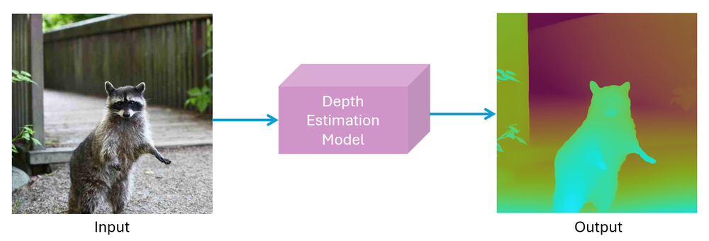
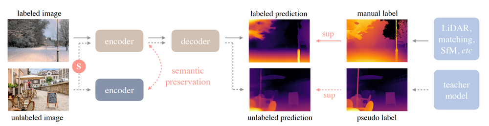
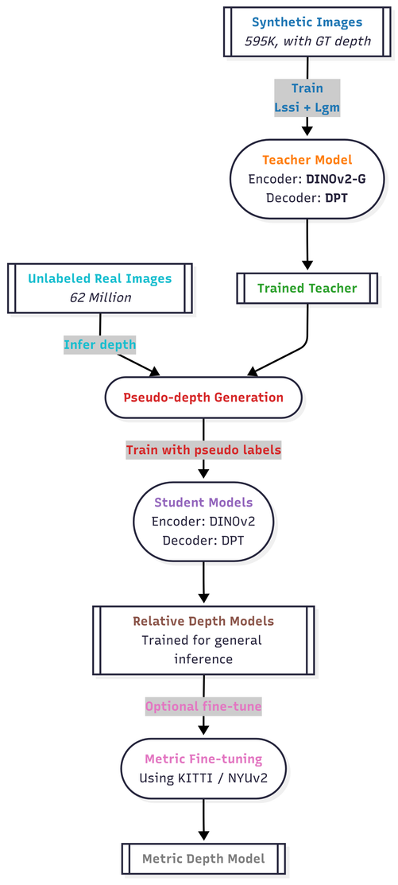
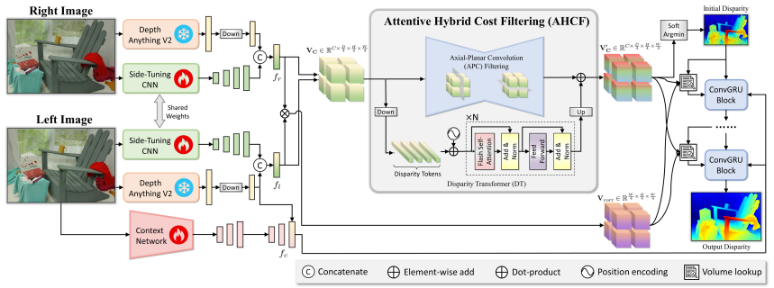
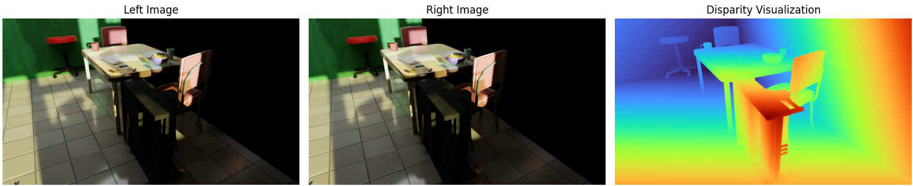
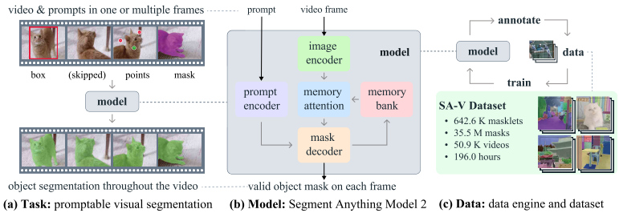

# Beyond Bounding Boxes: Engineering a 3D-Aware Vision Pipeline for Robotic Manipulation

If you ask a standard Object Detection model (like YOLO) to locate a wrench on a table, it will confidently draw a 2D rectangle around it. But a robotic arm cannot grasp a rectangle. Seventy percent of the pixels inside that bounding box are actually the empty table underneath the tool. If the robot's kinematics target the center of that box, the arm will execute an "air grasp," slamming its metallic grippers into the table and missing the handle entirely.

To build machines capable of robust, real-world physical manipulation, we must move beyond 2D approximations. A robot needs a Visual Cortex-a pipeline that understands absolute pixel boundaries and precise millimeter depth.

In this post, I will break down the architecture of a custom, multi-modal vision pipeline we engineered to solve this exact problem. By fusing a DepthAnythingV2 Backbone, a Foundation Stereo Head, and SAM 2 (Segment Anything 2) via a custom PyTorch Adapter, we built a spatial-temporal engine that allows robots to truly "see" in 3D.

## Phase 1: The Backbone (Semantic Feature Extraction)
To a robot, a camera feed doesn’t look like a room or a table; it is just a chaotic, massive spreadsheet of colored numbers. The foundation of any robotic vision pipeline is translating those raw pixels into a structured, semantic understanding of the physical world.

Rather than building an AI from scratch and trying to teach it what a "wrench" or a "doorway" looks like, we use a technique called Transfer Learning. We take a massive, pre-trained AI "brain" that has already studied millions of images and plug it into our robot.

## The Foundation: Meta's DINOv2 (The Semantic Brain)
Before we can extract depth, we need a model that fundamentally understands what it is looking at. For this, our pipeline relies on DINOv2, a Vision Transformer (ViT) created by Meta.

DINOv2 represents a massive shift in artificial intelligence. Older AI models relied on "Supervised Learning," which required humans to manually draw millions of bounding boxes around objects to teach the AI what things were. DINOv2, however, uses Self-Supervised Learning. It taught itself how to understand absolute object boundaries, individual parts, and scene context just by studying how different parts of an image relate to each other, much like how a human child learns by observing the world.

Here is the intuitive breakdown of how DINOv2's Vision Transformer processes our robot's camera feed:

**The Puzzle Pieces (Patchification):** Instead of scanning an image line by line like an older Convolutional Neural Network (CNN), the Vision Transformer physically chops the robot's camera feed into a grid of tiny squares, like pieces of a jigsaw puzzle.

**Connecting the Dots (Self-Attention):** This is the magic of the Transformer. The AI mathematically looks at every single puzzle piece and asks, "How does this piece relate to every other piece in the image?" For example, it calculates a strong connection between the pixels of a tool's handle and the pixels of its metal head. This ensures the robot understands the complete physical structure of an object, even if a robotic gripper is partially blocking the view.

**The Semantic Map:** After processing these puzzle pieces, DINOv2 outputs a dense "Feature Map." At this stage, the AI knows exactly what it is looking at and where the physical boundaries of the objects are located, perfectly separating objects from their backgrounds.

<p align="center">
  <video src="images/Dinov2.mp4" width="800" controls autoplay loop muted></video>
  <br>
  <b>Visualization of the three first principal components of the patch features of all frames, mapped to RGB values.</b>
</p>

## The Evolution: Depth Anything V2 (Adding Geometry)
While DINOv2 is incredible at understanding semantics (what things are), our robot also needs to know geometry (how far away things are). This is where we introduce Depth Anything V2.

Depth Anything V2 uses the DINOv2 architecture as its core visual backbone, but it explicitly trains that backbone to become a master of monocular (single-camera) depth estimation. By adopting Depth Anything V2, our robot inherits DINOv2's semantic understanding plus highly robust depth reasoning right out of the box.
<p align="center">
  
  <br>
  <b>Figure 1: Depth Anything V2 Overview ([Source: Roboflow](https://blog.roboflow.com/depth-anything/))</b>
</p>

### The Architecture: Depth Anything V2
For this project, we utilize [DepthAnythingV2](https://github.com/DepthAnything/Depth-Anything-V2) as our core visual backbone.

This model is built upon Meta's famous DINOv2 architecture, which is a Vision Transformer (ViT). DINOv2 represents a massive shift in artificial intelligence. 

By adopting Depth Anything V2 as our backbone, our robot inherits a visual cortex that provides incredibly robust, generalizable features right out of the box.

<p align="center">
  
  <br>
  <b>Figure 2: Depth Anything V2 Architecture ([Source: Roboflow](https://blog.roboflow.com/depth-anything/))</b>
</p>

### The Training Pipeline

Depth Anything V2 uses a multi-stage training framework to deliver robust performance across both synthetic and real-world imagery.

The following are the main stages of Depth Anything V2 training framework:

**Stage 1: Core Teacher Development** – In this initial phase, an expansive "Teacher" model (powered by architectures like DINOv2-G) is trained on over 500k synthetic samples. This ensures the model learns the fundamental laws of geometry and depth using pixel-perfect digital environments.

**Stage 2: Knowledge Expansion (Pseudo-Labeling)** – To help the AI transition from digital simulations to the messy real world, the teacher model processes approximately 62 million unlabeled real-world images. It establishes "pseudo-ground-truth" depth maps for these images, effectively bridging the gap between simulation and reality.

**Stage 3: Efficient Student Distillation** – We then transfer this hard-earned knowledge into more efficient "Student" models of varying sizes. These models are optimized for performance while maintaining the high-fidelity depth reasoning of the teacher, resulting in an engine that generalizes exceptionally well across diverse environments.

**Stage 4: Precision Metric Calibration (Optional)** – For tasks requiring exact physical measurements, the model undergoes final calibration using datasets with absolute distance values (like NYUv2 or KITTI). This transforms its relative understanding of "near and far" into absolute metric measurements.

<p align="center">
  
  <br>
  <b>Figure 3: Multi-stage Training Framework ([Source: Roboflow](https://blog.roboflow.com/depth-anything/))</b>
</p>

## The "Cyclops" Limitation

However, there is a fundamental limitation to this setup. While Depth Anything V2 is phenomenal at guessing depth from a single camera lens (monocular depth), it is still just an educated guess based on shadows and context.

Imagine a drone encountering a giant, hyper-realistic painting of a 10-foot wrench on a flat wall. A single camera might be fooled into thinking it is a real 3D object. To give a robotic arm absolute, millimeter-accurate instructions, we cannot rely on optical illusions or guesses. We must calculate the exact physical distance using geometry.

This is why we hand these rich visual features off to Phase 2.

## Phase 2: Foundation Stereo (Adding the Z-Axis)

If our robotic system only uses the single-camera backbone we built in Phase 1, it suffers from the "Cyclops Problem." A single lens can be easily fooled. It relies on optical illusions—like shadows, lighting, and object size—to guess how far away something is. 

If a drone is flying through a warehouse and sees a giant picture of a doorway printed on a flat wall, a monocular (single-lens) AI might confidently command the drone to fly straight into the concrete. 

To give a machine absolute, millimeter-accurate instructions, we cannot rely on optical illusions or guesses. We must calculate the exact physical distance using geometry. We do this by giving the robot a second eye.

### The Architecture: Foundation Stereo

Instead of building a heavy, cumbersome 3D-processing engine from scratch, we engineered a state-of-the-art Foundation Stereo (FS) head into our pipeline. You can see the open-source implementation of this type of foundational stereo model on [Foundation Stereo GitHub](https://github.com/NVlabs/FoundationStereo). This system takes the rich, semantic "puzzle pieces" (features) our backbone just extracted from the Left Camera and matches them against the raw feed from the Right Camera.

<p align="center">
  
  <br>
  <b>Figure 4: Foundation Stereo Architecture ([Source: ArXiv](https://arxiv.org/abs/2501.09898))</b>
</p>

**The Search Party (Feature Matching):** The AI takes a specific pixel from the left camera—say, the edge of a metallic gear—and searches for that exact same gear edge in the right camera's view. Because the two cameras are physically spaced apart (just like human eyes), that gear will appear slightly shifted in the right camera's image.

**The Cost Volume:** The AI builds a mathematical 3D grid called a "Cost Volume." It scores how well the pixels from the left lens match the pixels from the right lens. It efficiently searches horizontally across the images, discarding bad matches and locking onto the exact physical shift of every object in the scene.

**Calculating Disparity:** That visual shift is called disparity. Because we know the exact physical distance between our two camera lenses (the baseline) and the focal length of the cameras, we can use simple triangulation to convert that pixel shift into absolute depth:

$$Depth = \frac{Baseline \times Focal Length}{Disparity}$$

### The Final Output

By utilizing an efficient neural network architecture called EdgeNext within the stereo head, this entire matching process happens in milliseconds. 

The output is no longer a standard photograph. It is a dense Depth Map—a tensor of shape (1 x H x W). In this map, which you can see a real-world example of in Figure 5, every single pixel contains a hard numerical value representing its exact physical distance from the robot's lenses. The AI now knows with absolute certainty that the wrench is exactly 420 millimeters away, while the table underneath it is 450 millimeters away.

<p align="center">
  
  <br>
  <b>Figure 5: Input RGB vs. Output Depth Map ([Source: Foundation Stereo](https://github.com/NVlabs/FoundationStereo/))</b>
</p>

We now have two incredible streams of data: a semantic map that knows what the objects are (Phase 1), and a depth map that knows where they are in 3D space (Phase 2). 

But here is the ultimate engineering hurdle: The advanced AI we are using to physically segment these objects (SAM 2) has no idea how to read this 3D data. We have to build a custom bridge to fuse them together.

## Phase 3: The Custom Adapter (The Engineering Bridge)

At this point in our pipeline, we have two incredibly powerful streams of data flowing through the robot's brain:

-   **The Semantic Map (Phase 1):** A rich tensor that knows what objects are.
-   **The Depth Map (Phase 2):** A geometric tensor that knows where objects are in absolute 3D space.

In theory, we just need to hand this data over to our final segmentation model (SAM 2) to draw the physical boundaries around the objects so the robot can grasp them. In practice, trying to plug these raw tensors directly into SAM 2 will cause the architecture to crash. We hit a massive roadblock: **The Dimension Mismatch.**

### The Problem: Flat vs. Hierarchical Vision

Our vision backbone (DINOv2) outputs a single, "flat" feature map. It looks at the world at one specific resolution.

However, Segment Anything 2 (SAM 2) is a hierarchical model. To successfully segment a complex scene, SAM 2 needs to look at the world through multiple zoom levels simultaneously. It needs to see fine, millimeter-level details (like the teeth of a small gear) and massive global context (like the entire doorway the robot is flying through).

To do this, SAM 2 strictly requires a 4-level Multi-Scale Feature Pyramid at specific resolutions (strides 4, 8, 16, and 32). Furthermore, standard SAM 2 is designed for 2D images—it has no native idea how to read a 3D Depth Map.

### The Solution: The Spatial-Depth Adapter

To solve this, we engineered a custom PyTorch Adapter. This neural network module sits right in the middle of our pipeline. Let's break down the exact PyTorch architecture we built for this Adapter, step by step.

#### Part 1: The Mixer (Fusing Depth and RGB)
First, we need to mathematically merge our 1-channel Depth Map with our 768-channel Semantic Features. We initialize our class and set up the projection layers to bring them into the same dimensional space.

```python
import torch
import torch.nn as nn

class SpatialDepthAdapter(nn.Module):
    def __init__(self, feature_dim=768, depth_dim=1):
        super().__init__()
        
        # THE MIXER: Project depth map to match ViT feature channels
        self.depth_proj = nn.Conv2d(depth_dim, feature_dim, kernel_size=3, padding=1)
        
        # A fusion layer to smooth the concatenated RGB and Depth tensors
        self.fusion_layer = nn.Sequential(
            nn.Conv2d(feature_dim * 2, feature_dim, kernel_size=1),
            nn.GELU(),
            nn.LayerNorm([feature_dim, 14, 14]) # Assumes standard ViT 14x14 patch grid
        )
```

> [!NOTE]
> **Engineering Note:** We use a 1x1 Convolution in the fusion layer. This acts as a smart, learnable bottleneck that decides exactly how much depth information should influence the semantic understanding of the scene.

#### Part 2: The Translator (Building the Pyramid)
Next, we must translate this single fused tensor into the 4-level multi-scale pyramid that SAM 2 strictly demands.

```python
        # THE TRANSLATOR: Building the Multi-Scale Pyramid for SAM 2
        
        # Upsampling for fine edge details (Small Objects)
        self.stride_4 = nn.ConvTranspose2d(feature_dim, 256, kernel_size=4, stride=4)
        self.stride_8 = nn.ConvTranspose2d(feature_dim, 256, kernel_size=2, stride=2)
        
        # Standard resolution and Downsampling for global context (Large Objects)
        self.stride_16 = nn.Conv2d(feature_dim, 256, kernel_size=3, padding=1)
        self.stride_32 = nn.MaxPool2d(kernel_size=2, stride=2)
```

> [!NOTE]
> **Engineering Note:** We use `ConvTranspose2d` (often called deconvolution) to physically expand the spatial resolution for Strides 4 and 8. This is how the AI recovers the high-resolution details needed to segment thin wires or small tool handles. We use `MaxPool2d` to compress the image for Stride 32, giving the AI its global awareness.

#### Part 3: The Forward Pass (Execution)
Finally, we write the execution logic. This is where the geometric 3D data physically alters the semantic understanding of the scene during the forward pass.

```python
    def forward(self, rgb_features, depth_map):
        # 1. Format the Depth Map and stack it with the RGB features
        depth_feats = self.depth_proj(depth_map)
        fused = torch.cat([rgb_features, depth_feats], dim=1)
        fused = self.fusion_layer(fused)
        
        # 2. Extrude the pyramid at the 4 exact resolutions SAM 2 needs
        p4 = self.stride_4(fused)   # High resolution 
        p8 = self.stride_8(fused)   # Medium-High resolution 
        p16 = self.stride_16(fused) # Standard ViT resolution 
        p32 = self.stride_32(fused) # Low resolution / Global context
        
        # Hand off to SAM 2
        return p4, p8, p16, p32
```

## Phase 4: The Segmenter (SAM 2)

By explicitly injecting the depth tensor directly into the feature generation process, we force the AI to become geometrically aware. It doesn't just infer 3D shapes from 2D shadows anymore; it explicitly calculates the physical geometry of the scene at four different zoom levels.

We now have a perfect, depth-aware, multi-scale tensor pyramid. The stage is set to hand this data to the final boss of our vision pipeline: The **Segment Anything 2 (SAM 2)** .

### The Architecture: Segment Anything 2

<p align="center">
  
  <br>
  <b>Figure 6: SAM2 Architecture ([Source: SAM2](https://arxiv.org/abs/2408.00714))</b>
</p>


Developed by Meta, [SAM 2](https://github.com/facebookresearch/sam2) is the state-of-the-art foundation model for promptable visual segmentation. While the original SAM was a massive breakthrough for static 2D images, it had a critical weakness for robotics: it had no concept of time.

Robots do not operate in static photographs; they operate in continuous video. If a robotic arm swings toward a wrench, the camera feed is constantly shifting. The original SAM would have to re-evaluate the wrench in every single frame from scratch, causing massive latency and flickering masks.

SAM 2 introduces a **Spatial-Temporal Memory Mechanism**. It is explicitly designed for video.

### How the Execution Works

Here is how our custom pipeline feeds into the SAM 2 architecture to generate the final output:

**The Handoff:** We feed our custom, depth-aware multi-scale pyramid (Strides 4, 8, 16, and 32) directly into the SAM 2 Decoder. Because the lowest stride (Stride 4) contains high-resolution spatial details, SAM 2 can easily snap its boundaries to the exact physical edges of small objects, like thin cables or tool handles.

**The Temporal Memory:** As the robotic camera streams video, SAM 2 stores the features of the target object in a specialized "memory bank." If the robotic gripper temporarily blocks the camera's view of the wrench (an occlusion), SAM 2 doesn't panic and delete the mask. It uses its temporal memory to predict exactly where the wrench still is behind the gripper.

**The Final Output:** The model outputs a continuous, pixel-perfect Segmentation Mask at high frame rates.

## The Death of the "Air Grasp"

Let's return to the problem we introduced at the very beginning of this post: the danger of bounding boxes.

Because of this pipeline, our robot no longer sees a vague 2D rectangle containing 70% empty table space. Instead, the robot's kinematics engine receives an absolute, pixel-perfect silhouette of the tool, mathematically bound to a Z-axis depth coordinate.

The robotic arm knows exactly where the physical mass of the handle begins and ends. It can confidently execute a grasp, swooping in and securing the payload without ever touching the table. The "air grasp" is officially dead.

## Conclusion & Next Steps: Building the Motor Cortex

We have successfully built the "Eyes" and the "Visual Cortex" of our robot. It can look at a chaotic workbench, explicitly understand the semantic geometry of the scene, and draw persistent 3D-aware masks over its targets in real-time.

But seeing is only half the battle. The next phase of this project is translating those pixel-perfect masks into actual physical movement.

In my next post, I explored how we feed these localized SAM 2 features into a Reinforcement Learning (RL) environment. Using modern Actor-Critic algorithms (like PPO) and DeepMimic-style reference initialization in NVIDIA Isaac Sim, we will train the "Motor Cortex" that dynamically drives the physical hardware.

